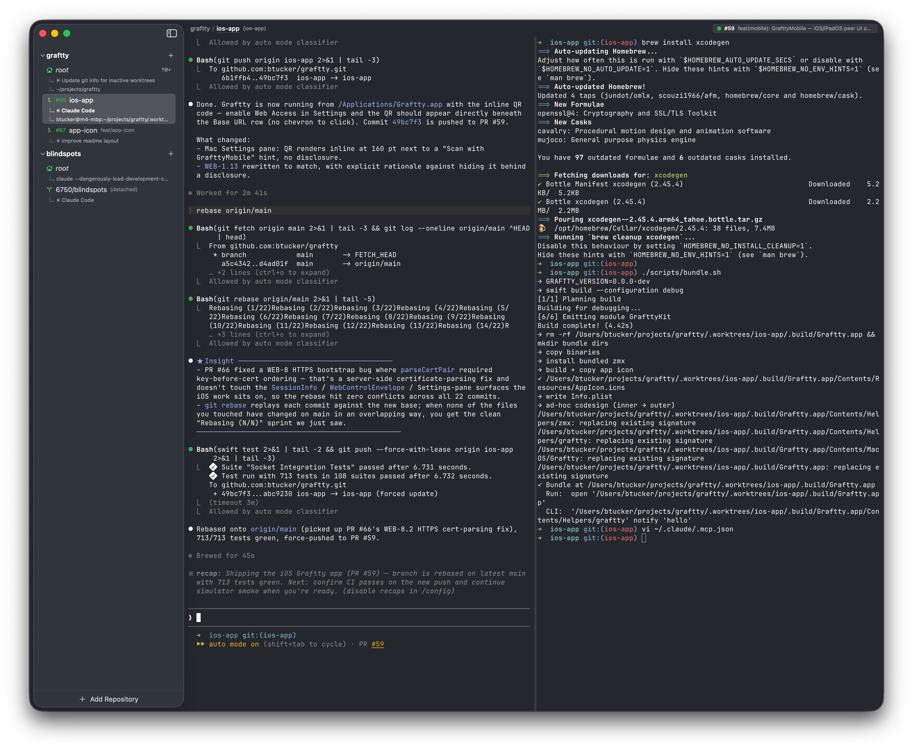

<p align="center">
  
</p>

# Graftty

A macOS worktree-aware terminal multiplexer built on [libghostty](https://ghostty.org) & [zmx.sh](https://zmx.sh/).

Graftty organizes persistent terminal sessions by git worktree. Each worktree in your sidebar has its own split layout of terminals that stay alive across worktree switches, and a CLI (`graftty`) lets running processes interact with the Graftty UI.

<p align="center">
  
</p>

## Installing

```sh
brew tap btucker/graftty
brew install --cask graftty
```

Installs `Graftty.app` to `/Applications` and symlinks the `graftty` CLI onto `PATH`. On first launch, macOS will block the app with Gatekeeper — approve it under System Settings → Privacy & Security (on Sonoma, right-click → Open). Uninstall with `brew uninstall --cask --zap graftty`.

## Building

Requires Xcode 15+ and macOS 14 Sonoma or later.

```sh
swift build
```

Open `Package.swift` in Xcode to run the app.

## Developing the web client

Graftty's browser-facing web access client lives in `web-client/` (React +
Vite + TypeScript + TanStack Router). If you change anything under
`web-client/`, rebuild the bundle that ships with the app:

```bash
./scripts/build-web.sh
```

This refreshes `Sources/GrafttyKit/Web/Resources/{index.html,app.js,app.css}`.
CI verifies the committed bundle matches a fresh build.

You need `node` (LTS) and `pnpm` installed locally for web-client work:

```bash
brew install node pnpm
```

If you only touch Swift, you need neither — the committed bundle is what
`swift build` ships, and Homebrew users get the prebuilt tarball.

## Further reading

- [`SPECS.md`](SPECS.md) — authoritative EARS-style behavior spec.
- [`docs/`](docs) — design notes and architecture details.

## License

MIT — see [`LICENSE`](LICENSE).
