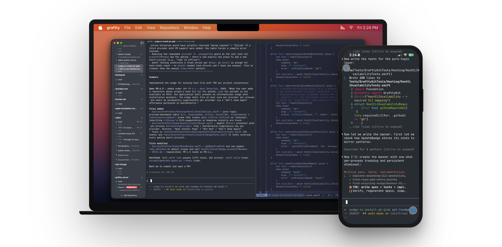

<p align="center">
  
</p>

# Graftty

A macOS worktree-aware terminal multiplexer built on [libghostty](https://ghostty.org) & [zmx.sh](https://zmx.sh/).

Graftty organizes persistent terminal sessions by git worktree. Each worktree in your sidebar has its own split layout of terminals that stay alive across worktree switches, and a CLI (`graftty`) lets running processes interact with the Graftty UI.

<p align="center">
  
</p>

## Installing

```sh
brew tap btucker/graftty
brew install --cask graftty
```

Installs `Graftty.app` to `/Applications` and symlinks the `graftty` CLI onto `PATH`. On first launch, macOS will block the app with Gatekeeper — approve it under System Settings → Privacy & Security (on Sonoma, right-click → Open). Uninstall with `brew uninstall --cask --zap graftty`.

Graftty updates itself. On first launch, you'll be asked whether
Graftty may check for updates automatically — if you agree, a small
indicator appears in the window titlebar when a new version is
available, and clicking it installs the update. You can also trigger a
check manually from `Graftty → Check for Updates…`.

## Agent teams

When a repo has more than one worktree open, Graftty treats it as an
*agent team*. AI coding agents (Claude Code, Codex, etc.) running inside
each worktree can register their presence, message each other through a
per-worktree inbox, and react to PR/CI events that affect the team —
useful when you've got one agent per branch grinding through PRs and
want them to coordinate.

Enable it under **Settings → Agent Teams**. From there you choose which
events (PR state, merges, CI conclusion, mergability) get routed to the
root agent, the per-worktree agent, peer worktrees, or any combination,
and customize the templated session and per-event prompts each agent
receives.

Each agent's session-start hook is decorated with team context plus the
CLI surface for coordination:

```sh
graftty team register --runtime claude   # announce presence at session start
graftty team list                        # see teammates, worktrees, and running state
graftty team send --stdin <member>       # read a direct message literally from stdin
graftty team broadcast --stdin           # read a broadcast literally from stdin
graftty team inbox                       # read your incoming messages
```

Delivery is hook-driven. Graftty installs `claude` and `codex` shims on
each agent's `PATH` that wire `SessionStart` and `Stop` hooks into the
runtime. `SessionStart` primes the agent with team context and your
session prompt; `Stop` triggers inbox delivery at the end of each turn.
For Claude Code, a `Stop`-spawned watcher wakes the agent on stderr
when a new message arrives; for Codex, a graftty-side service sends the
message into the active conversation through Codex's app server.

*Window → Team Activity Log* opens a unified transcript of every team
event and inter-agent message for the focused worktree's team.

When inbox messages aren't enough, any agent can drive a teammate's
pane directly — see **CLI** below for `graftty pane show` (read another
worktree's terminal) and `graftty pane send` (inject keystrokes).

## CLI

The bundled `graftty` CLI lets a process inside a Graftty pane drive the app, and lets one agent control panes in another worktree.

```sh
graftty notify "tests passing"               # set a sidebar attention badge
graftty pane list                            # panes in the current worktree
graftty pane add --command "claude"          # split + run a command
graftty pane close 2                         # close pane 2

# Launch an agent in a new worktree, then message that worktree's inbox:
graftty worktree add fix-auth --agent codex
# Copy the canonical address=... path printed by the command:
printf '%s\n' 'Please own the auth test failures.' | graftty team send --stdin /path/to/repo/.worktrees/fix-auth

# Cross-worktree pane control:
graftty pane list drag-files                 # list panes in another worktree
graftty pane show drag-files:1               # last 100 lines of that pane's output
graftty pane show drag-files:1 --lines 500   # more scrollback
graftty pane send drag-files:1 "pnpm test"   # type the command and press Enter
graftty pane send drag-files:1 "y" --no-enter  # type without committing
```

`<addr>` is `<id>` (current worktree, that pane), `<worktree>` (worktree's only pane), or `<worktree>:<id>`. Worktree names match what `graftty team list` prints. Run `graftty pane <verb> --help` for examples on every subcommand.

`graftty pane send` writes raw bytes to the addressed pane's PTY — there's no inbox or consent layer, so the keystrokes land in whatever process is reading that pane's stdin. Use `graftty team send` for cooperative messaging where the receiving agent decides what to do.

`graftty worktree add --agent` prints a canonical worktree-path address. Incoming worktree messages show that same stable path in their `from` label, so the recipient can reply with `graftty team send --stdin <address>` even if branches are renamed or display names collide.

## Building

Requires Xcode 15+ and macOS 14 Sonoma or later.

```sh
swift build
```

Open `Package.swift` in Xcode to run the app.

## Developing the web client

Graftty's browser-facing web access client lives in `web-client/` (React +
Vite + TypeScript + TanStack Router). If you change anything under
`web-client/`, rebuild the bundle that ships with the app:

```bash
./scripts/build-web.sh
```

This refreshes `Sources/GrafttyKit/Web/Resources/{index.html,app.js,app.css}`.
CI verifies the committed bundle matches a fresh build.

You need `node` (LTS) and `pnpm` installed locally for web-client work:

```bash
brew install node pnpm
```

If you only touch Swift, you need neither — the committed bundle is what
`swift build` ships, and Homebrew users get the prebuilt tarball.

## Further reading

- [`SPECS.md`](SPECS.md) — authoritative EARS-style behavior spec.
- [`docs/`](docs) — design notes and architecture details.

## License

MIT — see [`LICENSE`](LICENSE).
