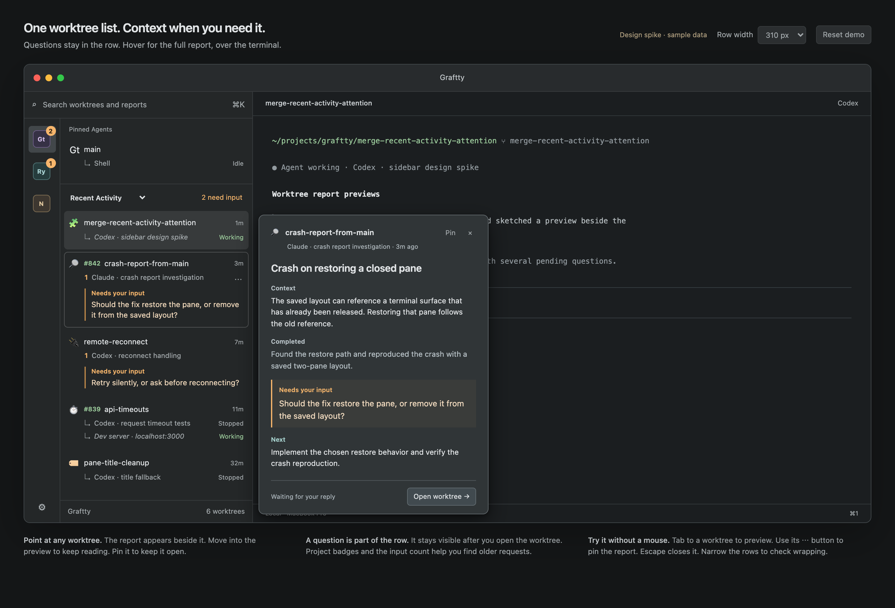

# Worktree reports in the Recent Activity list

This spike combines worktree navigation and agent reports in one sidebar. The separate Attention destination is removed. Pinned Agents, the project rail, pane rows, PR badges, and the existing sort choices remain.

Open the self-contained [interactive mock](index.html) in a browser. It uses sample data and does not connect to Graftty.

## Approved behavior

A stopped agent's full question appears beneath its associated pane, labeled “Needs your input.” There is no duplicate “Needs input” status. Successfully opening the worktree acknowledges the question and hides it from the row. Dismissal, agent resume, or a newer report also retires that occurrence. The latest recap remains available in the report preview.

On Mac, hovering for 250 milliseconds opens the report to the right, over the terminal. A 300 millisecond dismissal delay lets the pointer cross into it. Hover leaves terminal selection and focus alone. Pin keeps the report open; Close and Escape dismiss it. The keyboard-accessible report button opens and focuses the same panel.

On iPhone and iPad, holding a row for 500 milliseconds opens the report without selecting the terminal. iPad uses an anchored popover; compact layouts use a sheet. Normal taps open the terminal. Scrolling, swipe actions, and Edit-mode reordering retain their gestures. VoiceOver exposes Show report.

Project counts and pending-worktree navigation retain cross-project discovery. Pending navigation follows displayed folder order and wraps. Reports participate in worktree search. While a report is open, positions and pin/folder membership stay fixed while report content updates.

The native implementation keeps the existing one-latest-recap-per-worktree model. Hosts publish the retained recap after acknowledgement; clients preserve a local fallback for older hosts. Shell notifications and other attention sources keep their existing indicators and routing.

## Validation

The initial browser spike passed 29 interaction and geometry checks. Its screenshots show the proposed appearance; the approved acknowledgement behavior above supersedes the original question-persistence experiment.

Native tests cover request acknowledgement and failure, retained reports, stale snapshots, path reuse, pending traversal, presentation freezing, report widths, hover timing, pinning, focus, anchor removal, and stale preview dismissal. The native report was rendered and visually inspected at 260- and 380-point widths; see the [native report capture](native-report.png). The integrated iPhone Simulator suite passed 444 tests, followed by 23 focused navigation tests. Real simulator gestures verified hold, tap suppression, scrolling, swipe actions, Edit-mode reorder, and iPad popover placement.

The full SwiftPM run passed the new report tests but hit timing failures in the existing RemoteBranchStore, TeamPresenceStorage, and WorktreeSleepWake tests; those passed focused reruns. Paired-host hardware navigation, pointer hardware, and spoken VoiceOver still need device verification.
